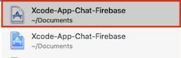

# Xcode-App-Chat-Firebase
App de chat con firebase realizada con Xcode 10.1
## Requisitos

Es necesario tener instalado el plugin de Cocoa Pods, si no lo tienes instalado visita el sitio web [https://cocoapods.org/](https://cocoapods.org/)

## Instrucciones

Descargar este repositorio, acceder a la carpeta raíz del proyecto e introducir el siguiente comando en un terminal

```
pod install
```

Con los paquetes descargados abrir el fichero **Xcode-App-Chat-Firebase.xcworkspace** 



## Actualizar dependencias

Si por algún motivo es necesario actualizar los paquetes de Cocoa accede a la raíz del proyecto e introduce los siguientes comandos en un terminal

```
pod deintegrate
```
```
pod install
```